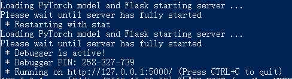

# flask_pytorch
using flask to run pytorch model

# start server
```sh
python3 app.py
```
you will see a result like this


# Submitting requests to pytorch server
```sh
python3 request_sample.py -f='file_path'
```
send a image like this


you will see a result like this (I use the mnist image as example).

# Acknowledgement
This repository refers to [deploy-pytorch-model](https://github.com/L1aoXingyu/deploy-pytorch-model), and thank the author again.